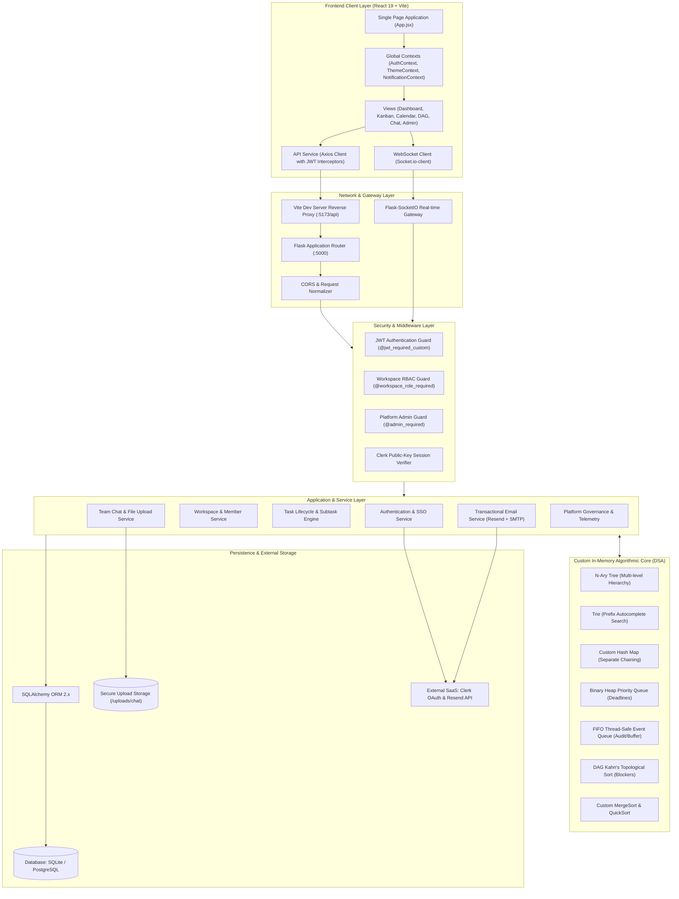
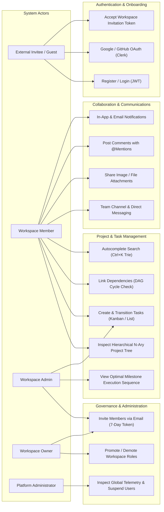
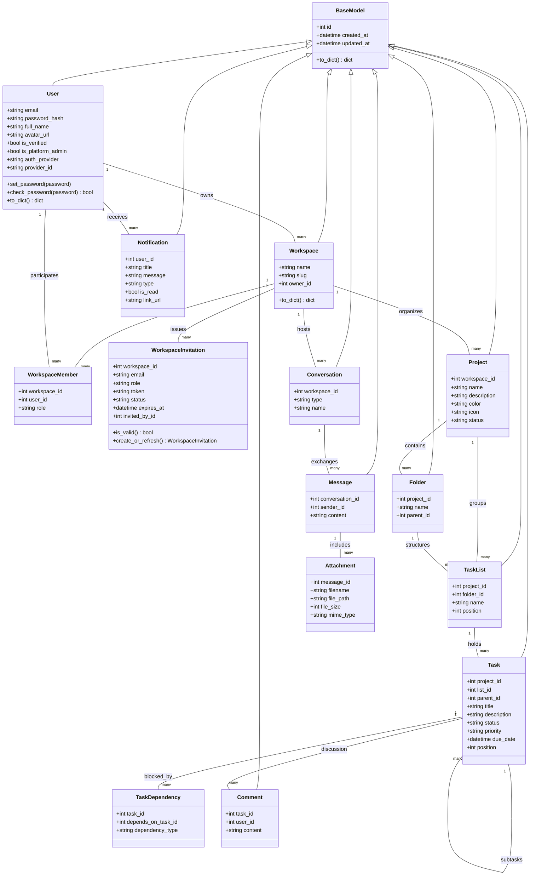
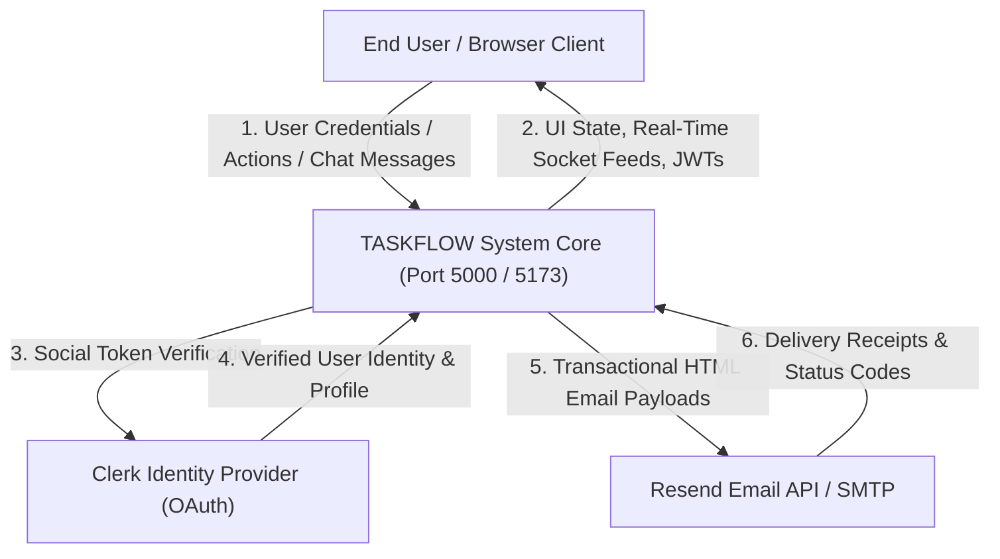
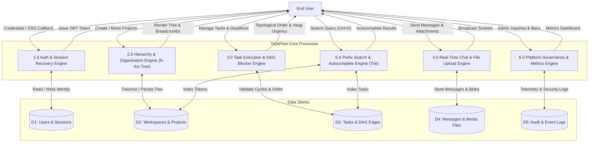
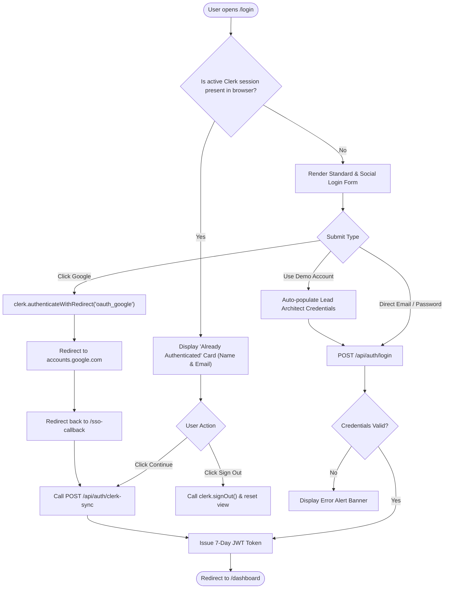
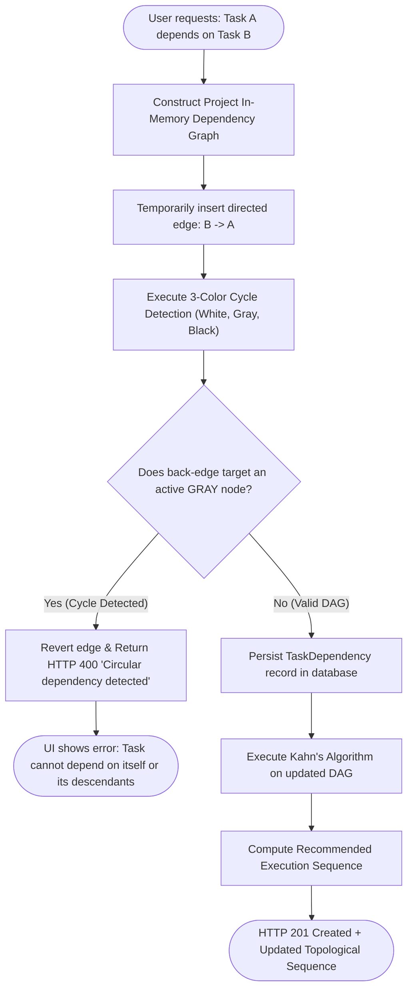

# TASKFLOW: Enterprise Multi-Tier Project Management Platform
## DOCUMENT 1: Complete Technical Design & Architectural Project Report

---

## 1. Executive Summary & Problem Definition

Modern project management platforms frequently face a dual architectural challenge:
1. **Relational Database Overhead:** Traditional relational databases perform well for static CRUD records, but degrade rapidly when processing recursive hierarchical trees (e.g., workspaces, projects, folders, lists, subtasks), prefix autocompletion queries (`LIKE '%term%'`), deadline priority scheduling, and cycle-deadlock detection in complex dependency networks.
2. **Real-Time Collaboration Latency:** Distributed teams require instant bi-directional updates for messaging, task movement, status mutations, and event streaming without relying on resource-intensive HTTP polling.

**TASKFLOW** resolves these challenges by coupling a modular **Flask 3.0** backend and **React 19** frontend with **7 custom in-memory Data Structures and Algorithms (DSA)** alongside **Flask-SocketIO** for real-time collaboration. The architecture guarantees sub-millisecond in-memory computations for dependency graphs, trie lookups, priority queues, and organization trees, while preserving relational consistency in **SQLAlchemy / SQLite / PostgreSQL**.

---

## 2. High-Level Design (HLD)

### 2.1 Architectural Pattern
TaskFlow follows a **Layered Micro-Modular Architecture** enriched with an **In-Memory Computational Domain Layer** and an **Event-Driven WebSocket Gateway**.

### 2.2 Technology Stack

| Layer | Component | Technology & Version | Purpose |
| :--- | :--- | :--- | :--- |
| **Frontend UI** | Framework | React 19.0.0 | Component rendering, hooks, reactive UI |
| **Build Tool** | Bundler / Server | Vite 8.3.1 | Hot Module Replacement, optimized bundling |
| **Styling** | Utility CSS | Tailwind CSS 4.x + Lucide Icons | Responsive UI, dark/light theme |
| **Backend API** | Web Framework | Python 3.10+ / Flask 3.0.0 | RESTful API controllers, routing |
| **Real-time** | WebSockets | Flask-SocketIO 5.3.6 / Socket.IO | Bi-directional chat, typing indicators |
| **ORM / DB** | Persistence | SQLAlchemy 2.0 / SQLite / PostgreSQL | Relational modeling, migrations, foreign keys |
| **Auth** | Security | Flask-JWT-Extended + Clerk React SDK | Stateless JWT & Social SSO (Google/GitHub) |
| **Email** | Transactional | Resend HTTPS API / SMTP TLS | HTML templates, invite tokens, alerts |

---

## 3. Use Case Modeling

### 3.1 Primary Actors

1. **Platform Administrator:** Global system operator managing user access, tenant workspaces, platform-wide metrics, and audit streams.
2. **Workspace Owner:** Tenant creator with full governance over billing, workspace settings, role assignments, and project purges.
3. **Workspace Administrator:** Team manager provisioning projects, folders, task lists, and managing invitations.
4. **Workspace Member:** Day-to-day team member creating tasks, managing dependencies, posting comments, and chatting in channels.
5. **Workspace Viewer:** Read-only stakeholder inspecting boards, timeline charts, and project trees.
6. **External Invitee / Guest:** Prospective user receiving 7-day token invitations via email to join specific workspaces.

### 3.2 Use Case Diagram

---

## 4. Low-Level Design (LLD)

### 4.1 REST API Specification Matrix

| Endpoint | Method | Role Required | Description |
| :--- | :---: | :---: | :--- |
| `/api/auth/register` | `POST` | Public | Register new user account and auto-resolve pending invitations |
| `/api/auth/login` | `POST` | Public | Authenticate credentials and issue standard 7-day JWT |
| `/api/auth/clerk-sync` | `POST` | Public | Synchronize verified Clerk / Google OAuth token with TaskFlow |
| `/api/auth/me` | `GET` | Authenticated | Retrieve authenticated user profile and accessible workspaces |
| `/api/workspaces` | `GET` / `POST` | Authenticated | List member workspaces or create new workspace |
| `/api/workspaces/:id/invitations` | `POST` | Admin / Owner | Send 7-day cryptographically secure invitation email |
| `/api/workspaces/invitations/:token` | `GET` / `POST` | Public / Auth | Inspect invitation validity and accept membership |
| `/api/projects` | `GET` / `POST` | Authenticated | List workspace projects or create a new project |
| `/api/projects/:id/tree` | `GET` | Member+ | Retrieve complete recursive N-Ary tree representation |
| `/api/tasks` | `GET` / `POST` | Member+ | Query tasks (sorted via MergeSort) or create task |
| `/api/tasks/:id/dependencies` | `POST` | Member+ | Add prerequisite task dependency with DAG cycle rejection |
| `/api/dsa/dependency-analysis` | `GET` | Member+ | Return Kahn's topological sort sequence and cycle status |
| `/api/search` | `GET` | Member+ | Multi-entity prefix search executed against the Trie engine |
| `/api/chat/conversations` | `GET` / `POST` | Member+ | List active channels/DMs or initialize a new conversation |
| `/api/chat/messages/:id/attachments`| `POST` | Member+ | Upload attachment with MIME validation and size limits |
| `/api/admin/users` | `GET` / `PATCH` | Platform Admin| List all system accounts or toggle active suspension state |
| `/api/admin/metrics` | `GET` | Platform Admin| Aggregated platform throughput, entity counts, storage stats |

---

### 4.2 Real-Time WebSocket Event Contract

The application establishes authenticated, duplex WebSockets via `flask_socketio`:

| Event Name | Direction | Payload Schema | Functional Action |
| :--- | :---: | :--- | :--- |
| `join_workspace` | Client $\rightarrow$ Server | `{ workspace_id: int }` | Subscribes socket to workspace broadcast room |
| `join_conversation`| Client $\rightarrow$ Server | `{ conversation_id: int }` | Joins individual chat room for live message distribution |
| `typing_start` | Client $\rightarrow$ Server | `{ conversation_id: int, user_name: str }` | Broadcasts live typing banner to conversation room |
| `typing_stop` | Client $\rightarrow$ Server | `{ conversation_id: int, user_name: str }` | Clears active typing status indicator |
| `new_message` | Server $\rightarrow$ Client | `{ id, content, sender, attachments, created_at }` | Real-time message append to all open client chat views |
| `notification_alert` | Server $\rightarrow$ Client | `{ id, title, message, type, link_url }` | Fires top-right toast alert and bumps inbox badge |

---

### 4.3 Algorithmic Core: 7 Custom In-Memory DSA Engines

#### 1. N-Ary Tree Hierarchy Engine (`backend/dsa/n_ary_tree.py`)
- **Structure:** Arbitrary-degree hierarchical tree with node classes storing references to parent, child dictionary, and entity payload.
- **Operations:**
  - `add_child(parent_id, node)`: $O(1)$ child append.
  - `get_path_to_root(node_id)`: $O(d)$ path accumulation for dynamic breadcrumbs.
  - `compute_subtree_metrics(node_id)`: Post-order DFS calculating total tasks, completed percentages, and overdue aggregates in $O(N)$ time.

#### 2. Trie Prefix Search Engine (`backend/dsa/trie.py`)
- **Structure:** 26+ character branching prefix tree containing terminal payload sets.
- **Operations:**
  - Tokenization: Splits multi-word phrases and tags (`#frontend`, `task-123`).
  - `insert(token, entity)`: $O(L)$ where $L$ is token character length.
  - `search_prefix(prefix)`: Traverses to prefix node in $O(P)$ and executes BFS gathering descendant payloads up to limit $M$ in $O(P + M)$ time.

#### 3. Custom Hash Map Cache (`backend/dsa/hash_map.py`)
- **Structure:** Array of linked lists (separate chaining collision resolution) utilizing polynomial rolling hash keys:
  $$\text{Hash}(S) = \sum_{i=0}^{k-1} S[i] \cdot p^i \pmod m$$
- **Operations:**
  - Automatic resizing when load factor $\lambda = \frac{N}{\text{buckets}} > 0.75$.
  - Array capacity doubles ($2B$) and all entries are re-hashed in $O(N)$ amortized time.
  - `get`, `put`, `remove`: Average $O(1)$, Worst case $O(N)$ under adversarial collision.

#### 4. Priority Queue Deadline Scheduler (`backend/dsa/priority_queue.py`)
- **Structure:** Array-backed complete binary heap implementing both Max-Heap (for priority scores) and Min-Heap (for earliest deadline timestamps).
- **Operations:**
  - `push(item)`: Appends to end and bubbles up (sift-up) in $O(\log N)$ time.
  - `pop()`: Replaces root with last element and sifts down in $O(\log N)$ time.
  - `peek()`: Inspects top priority item in $O(1)$ time.

#### 5. FIFO Event Queue (`backend/dsa/event_queue.py`)
- **Structure:** Circular bounded buffer with re-entrant thread locking (`threading.Lock`).
- **Operations:**
  - `enqueue(event)`: $O(1)$ atomic append with buffer full policy.
  - `dequeue()`: $O(1)$ atomic extraction for worker threads processing email dispatch and audit logging.

#### 6. Directed Acyclic Graph (DAG) Blocker Engine (`backend/dsa/dependency_graph.py`)
- **Structure:** Adjacency list graph representation storing directed edges $(u, v)$ where $u$ must complete before $v$.
- **Algorithms:**
  1. **Cycle Detection:** 3-Color Depth First Search (WHITE = unvisited, GRAY = active on recursion stack, BLACK = fully explored). If an edge targets a GRAY node, a cycle deadlock is detected, and the dependency is rejected ($O(V + E)$).
  2. **Kahn's Topological Sort:** Calculates in-degrees for all vertices; pushes vertices with $\text{in-degree} = 0$ into a queue; iteratively removes vertices, appends to sequence, and decrements neighbor in-degrees ($O(V + E)$).

#### 7. Custom MergeSort & QuickSort Utilities (`backend/dsa/sorting_utils.py`)
- **Structure:** Pure algorithmic implementations independent of standard library wrappers.
- **Operations:**
  - `mergesort(items, key, reverse)`: Stable $O(N \log N)$ sorting preserving relative order for multi-criteria table filtering.
  - `quicksort(items, key)`: In-place 3-way partition sorting with randomized pivot selection.

---

## 5. UML Class Diagram

---

## 6. Data Flow Diagrams (DFD)

### 6.1 DFD Level 0 (Context Level Diagram)

### 6.2 DFD Level 1 (Decomposition Diagram)

---

## 7. Critical Workflow Flowcharts

### 7.1 User Authentication & Clerk Session Recovery

### 7.2 Task Dependency Linking & DAG Cycle Prevention

